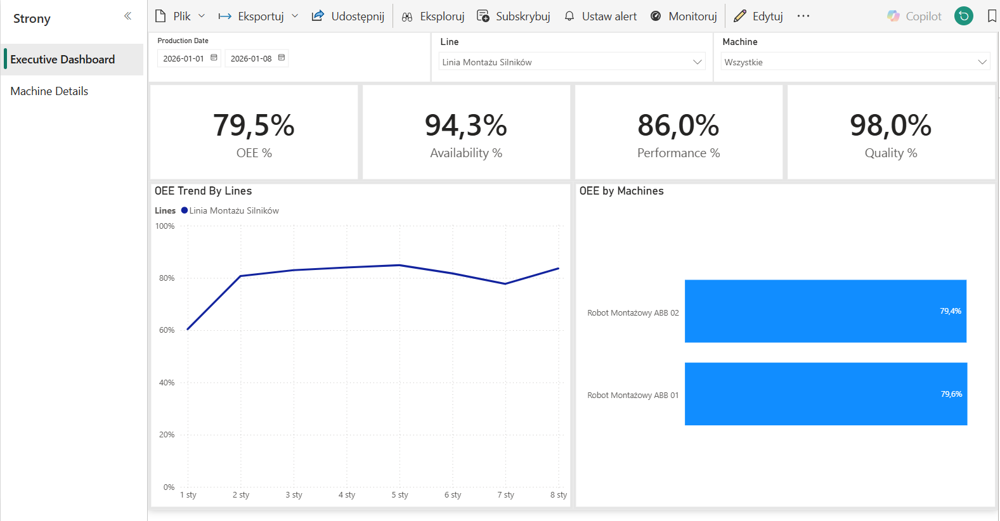
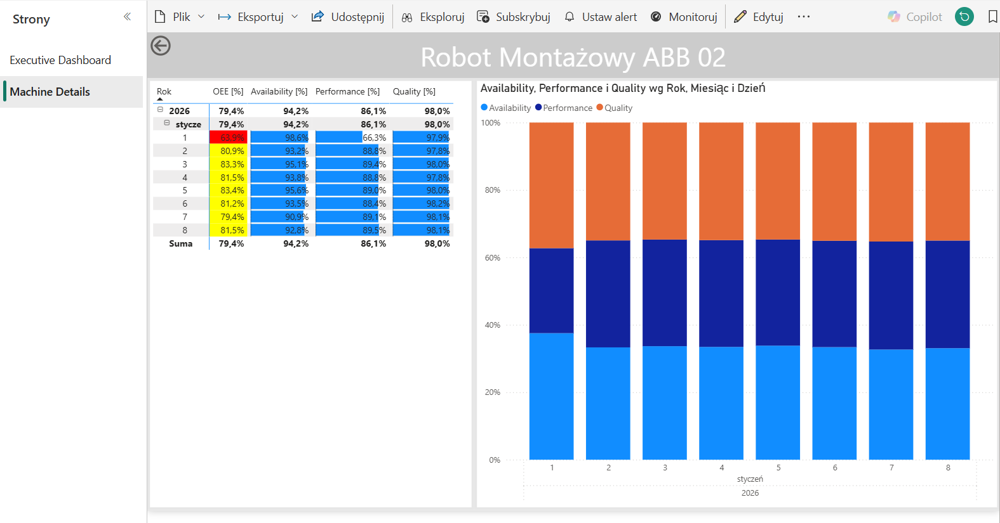

# 🏭 Smart Factory OEE Analytics

## 📝 Opis Projektu
**Smart Factory OEE Analytics** to projekt typu End-to-End realizujący proces Business Intelligence: od surowych danych po gotowy raport zarządczy. System symuluje działanie procesów produkcyjnych i umożliwia analizę kluczowego wskaźnika efektywności – **OEE (Overall Equipment Effectiveness)**.

**Struktura repozytorium:**
Repozytorium stanowi agregację kodów źródłowych dwóch modułów w celu prezentacji pełnego potoku danych (Data Pipeline):
1. **Moduł Python** – generator danych telemetrycznych i symulator pracy maszyn.
2. **Moduł SQL** – hurtownia danych oraz warstwa transformacji ETL.

Projekt demonstruje skalowalną architekturę analityczną: **Generator ➡ Baza SQL (Star Schema) ➡ Power BI**.

---

## 🛠️ Technologie

* **Python (Pandas, PyODBC):** Skrypt odpowiadający za symulację pracy maszyn. Generowane są cykle produkcyjne, losowe zdarzenia awaryjne oraz statusy kontroli jakości (braki/dobre sztuki).
* **SQL Server (T-SQL):** Magazyn danych zaprojektowany w oparciu o model gwiazdy (**Star Schema**). W celu sprawdzenia jakości generowanych danych telemetrycznych utworzono Procedurę Składowaną (`LoadTelemetry`), która przy nieprawidłowych wartościach loguje błąd do tabeli ErrorLog. Wykorzystano Widoki (`Views`) do agregacji danych i przygotowania warstwy semantycznej.
* **Power BI:** Warstwa wizualizacji danych. Zastosowano miary DAX, funkcję Drill-through oraz formatowanie warunkowe w celu diagnostyki przyczyn spadków wydajności.

---

### Panel Główny (Executive)

*Widok ogólny z możliwością filtrowania czasu i linii produkcyjnych.*

### Szczegóły Maszyny (Diagnostyka)

*Widok szczegółowy wykorzystujący paski danych do analizy przyczyn awarii.*

---

## 📂 Struktura Plików

Projekt został podzielony na moduły funkcjonalne zgodnie z poniższym schematem:

```text
SmartFactory_OEE_Analytics/
│
├── img/                        # Zrzuty ekranu wykorzystywane w dokumentacji
│   ├── ExecutiveDashboard.png
│   └── DrillThrough.png
│
├── python/                     # Kod źródłowy generatora danych
│   ├── database/               # Moduł obsługi bazy danych
│   │   ├── db_connector.py     # Konfiguracja połączenia
│   │   └── db_insertion.py     # Logika zapisu rekordów
│   └── simulator/              # Główna logika symulacji
│       ├── data_generator.py   # Generowanie parametrów losowych
│       └── simulator.py        # Start symulacji
│
├── sql/                        # Skrypty T-SQL (Hurtownia Danych)
│   ├── 01_DDL_Create_Tables.sql          # Tworzenie struktury tabel
│   ├── 02_DML_Fill_Dim_Tables.sql        # Zasilanie wymiarów statycznych
│   ├── 03_DML_Fill_fct_ProductionPlan.sql
│   ├── usp_LoadTelemetry.sql             # Procedura składowana
│   ├── v_Daily_Availability.sql          # Widok liczący dostępność
│   ├── v_Daily_Performance.sql           # Widok liczący wydajność
│   ├── v_Daily_Quality.sql               # Widok liczący jakość
│   └── v_OEE_FactSheet.sql               # Widoki analityczne (Warstwa semantyczna)
│
├── SmartFactoryReport.pbix     # Gotowy plik raportu Power BI
└── README.md                   # Dokumentacja techniczna
```

---

## 📬 Kontakt
Autor: **Igor Sarnowski**
* LinkedIn: https://www.linkedin.com/in/igor-sarnowski-9921202a1/
* GitHub: https://github.com/1G4S